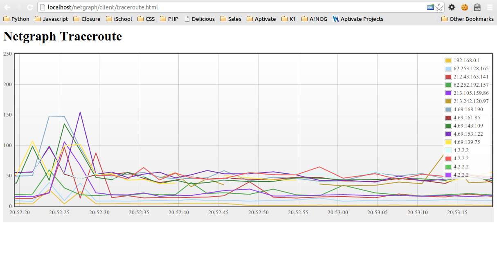

# Netgraph Application

Network data collection and graphing, server component.

This application can be installed on your router or gateway and accessed
via a web browser to collect real-time live data about the performance of
your Internet connection.

Sorry there's not much documentation at the moment.

## Installation

Checkout the project from Git somewhere that your Web server (e.g. Apache)
can access it. Ensure that Apache is configured to enable CGI and PHP, and
you have the MTR (Matt's Traceroute) application installed if you want to
display traceroute graphs.

The following instructions assume that the code is checked out in the
following directory. Please change all references to match where you checked
out the code:

	/home/installuser/projects/netgraph

Add the following to your Apache configuration, changing the directory
where necessary:

	Alias /netgraph/server/traceroute /home/installuser/projects/netgraph/server-php/traceroute.php
	Alias /netgraph/server/iptables   /home/installuser/projects/netgraph/server-php/iptables.php
	Alias /netgraph/server/pmacct     /home/installuser/projects/netgraph/server-php/pmacct.php
	Alias /netgraph/server /home/installuser/projects/netgraph/server
	Alias /netgraph/client /home/installuser/projects/netgraph/client
	<Directory /home/installuser/projects/netgraph/server>
		SetHandler fcgid-script
		Options +ExecCGI
		FcgidWrapper "/usr/bin/sudo /home/installuser/projects/netgraph/server/netgraph-server fastcgi" virtual
		Allow from all
	</Directory>

Reload or restart Apache, and check that you can access http://localhost/netgraph/server/traceroute
in your browser and you get a valid JSON response. This is what I get,
reformatted for readability:

	{"protocol":"NetGraph-traceroute","doc":"http:\/\/github.com\/qris\/netgraph","version":[1,1],
	"hops":{
		"1":{"host":"192.168.0.1","rtt":"1669"},
		"3":{"host":"62.253.128.165","rtt":"11127"},
		"4":{"host":"212.43.163.141","rtt":"14866"},
		"5":{"host":"62.252.192.157","rtt":"16439"},
		"6":{"host":"213.105.159.86","rtt":"16479"},
		"7":{"host":"213.242.120.97","rtt":"39547"},
		"8":{"host":"4.69.168.190","rtt":"51182"},
		"9":{"host":"4.69.161.85","rtt":"53903"},
		"10":{"host":"4.69.143.109","rtt":"51896"},
		"11":{"host":"4.69.153.122","rtt":"47552"},
		"12":{"host":"4.69.139.75","rtt":"47778"},
		"13":{"host":"4.2.2.2","rtt":"64620"},
		"14":{"host":"4.2.2.2","rtt":"65687"}}}

Check that you can access the client using your web browser at
http://localhost/netgraph/client/traceroute.html. You should see a graph
that updates live, and will soon look something like this:

## Sudo Setup

You should not need any of this stuff, but in case you do, here it is:

You need to be able to run the `netgraph-server` application as root
using the `sudo` command. I added the following lines to `/etc/sudoers`,
which are appropriate if you're using a Debian/Ubuntu server:

	www-data ALL=(ALL) NOPASSWD: /home/installuser/projects/netgraph/server/netgraph-server
	www-data ALL=(ALL) NOPASSWD: /sbin/iptables

Then you should be able to run the following command, and see some JSON
output:

	sudo -u www-data sudo /home/installuser/projects/netgraph/server/netgraph-server

